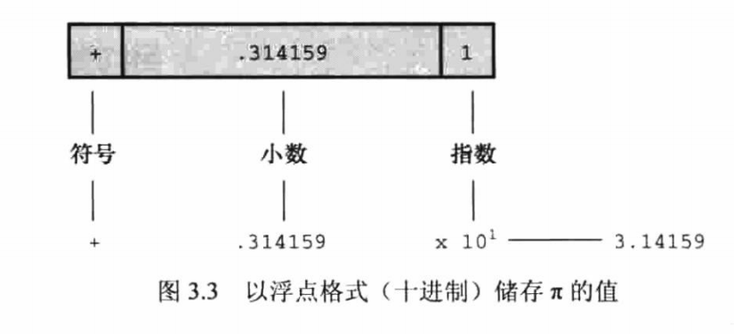
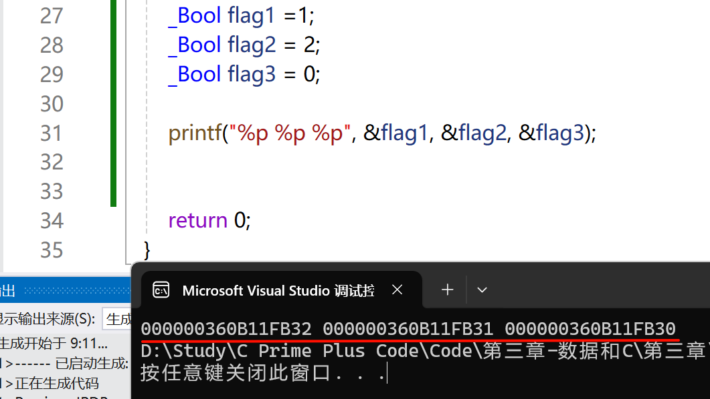
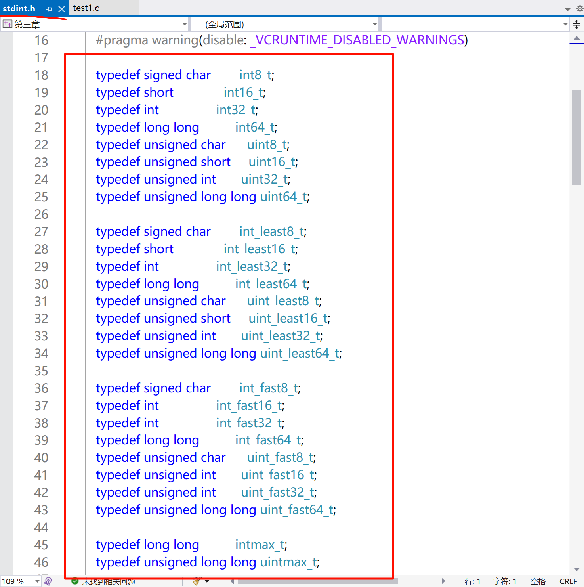
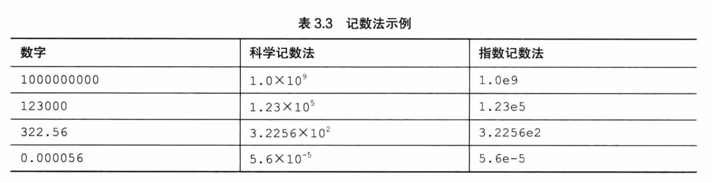
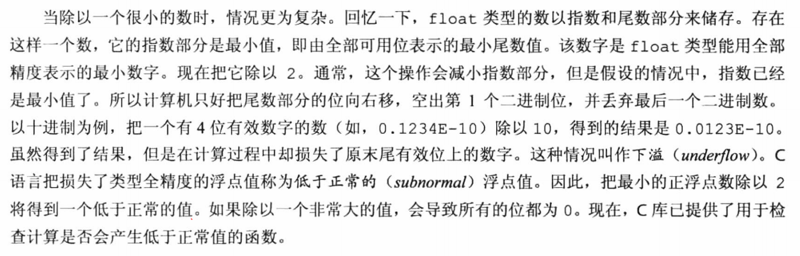
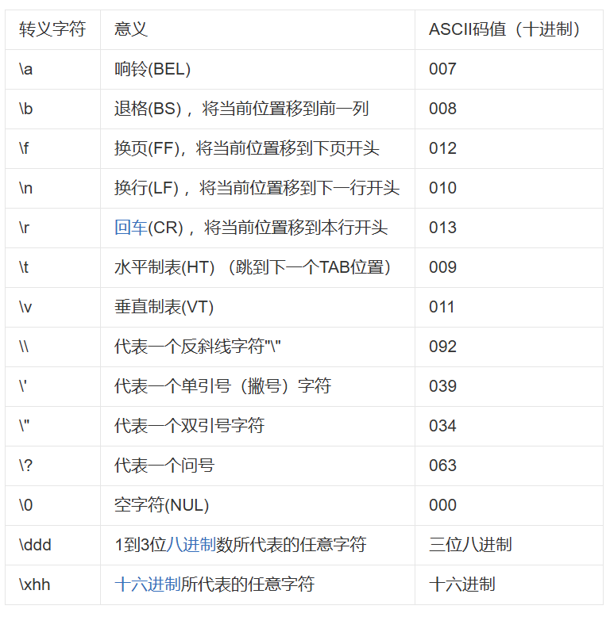

# 第三章-数据和C

## 3.1 示例程序

```c
#include <stdio.h>

int main(void)
{
	float weight;
	float value;

	printf("Are you worth your weight in platinum?\n");
	printf("Let's check it out.\n");
	printf("Please enter your weight in pounds:");

	scanf("%f1", &weight);

	value = 1700.0 * weight * 14.5833;
	printf("Your weight in platinum is worth $%.2f.\n", value);
	printf("Your are easily worth that! IF platinum prices drop,\n");
	printf("eat more to maintain your value. \n");


	return 0;
}
```

### 3.1.1 程序中的新元素

浮点数类型（float）的变量，可以存储带小数的数字。

printf()中 使用%f来处理浮点值。%.2f中的.2用于精确控制输出，指定输出的浮点数指显示小数点后面两位。

## 3.2 变量与常量数据

​	有些数据类型在程序使用之前已经预先设定好了，在整个程序的运行过程中没有变化，这些称为**常量**。

其他数据理性在程序运行期间可能会改变或被赋值，这些称为**变量**。

## 3.3 数据：数据类型关键字

计算机的储存可分为两大基本来兴：整数累心和浮点数类型。

**位、字节和字**

> 最小的存储单元是位(bit)，可以储存0或1。位是计算机内存的基本构件块。
>
> 字节(byte) 是常见的计算机存储单位。1字节均为8位。8位字节就有256中可能。
>
> 字(word) 是设计计算机时给定的自然存储单位。

### 3.3.1 整数和浮点数

### 3.2.2 整数

在C语言中，整数是没有小数部分的数。

### 3.3.3 浮点数

2.75、3.16E7、7.00和2e-8都是浮点数。

3.16E7表示3.16* 10^7，7被称为10的指数。



- 整数没有小数部分，浮点数有小数部分。
- 浮点数可以表示得到范围比整数大。
- 对于一些算术运算（如：两个很大的数相减），浮点数损失的精度更多。
- 因为在任何区间内都存在无穷多个实数，所以计算机的浮点数不能表示区间内所有的值。浮点数通常只是实际值的近似值。
- 过去，浮点运算比整数运算慢。现在缩小了速度上的差距。

## 3.4 C语言基本数据类型

### 3.4.1 int类型

​	int类型是有符号整型，即int类型的值必须是整数，可以是正整数、负整数或零。取值范围依计算机系统而异。

#### 1. 声明int变量

```c
int erns; // 单独声明
int hosg, cows,goats; // 变量名之间用逗号间隔
```


#### 2. 初始化变量

初始化(initialise)变量就是为变量赋一个初始值。在C语言中，初始化可以直接在声明中完成。

```c
int hosg =21;
int cow = 32,goasts = 14;
int dogs,cars = 96; // 这里只初始化了cars，dogs并未初始化
```

#### 3. int 类型常量

​	上面中出的整数（21，32，14和94）都是整形常量或整形字面量。C语言把不含小数点和指数的数作为整数。

#### 4. 打印 int 值

要确保转换说明的数量与待打印值的**数量相同**，编译器**不会**捕获这类型的错误。


> 编译的时候未出现错误
>
> 执行的时候才会报错

​	大部分函数都需要指定数目的参数，编译器会检查参数的数目是否正确。但是，**printf() 函数的参数数目不定**，可能有1个、2个、3个或更多，编译器也爱莫能助。

5. 八进制和十六进制

**0x**或0X前缀	表示**十六进制值**

**0**前缀	表示**八进制**

6.  显示八进制和十六进制

- 十进制显示数字，使用 `%d`
- 八进制显示数字，使用`%o`
- 十六进制显示数字，用`%x`
- 显示数字前缀在加`#`即 `%#d`，`%#o`，`%#x`

### 3.4.2 其他整数类型

在任何有符号类型前面添加关键字 `signed`，可强调使用**有符号类型**的意图。

#### 1. 声明其他整数类型

#### 2.使用多种整数类型的原因

​	C语言只规定了short占用的存储空间不能多与int，long占用的存储空间不能少于int。这样规定是为了适应不同的机器。

​	如果一个数值超出了 `int` 类型的取值范围（例如，大于 `INT_MAX` 或小于 `INT_MIN`），但在 `long` 类型的取值范围内，那么**必须**使用 `long` 类型来存储该数值，否则会导致**数据溢出**或**错误**。

​	在某些系统中，`long` 类型占用的存储空间比 `int` 更大（例如，`int` 是 32 位，`long` 是 64 位）。这种情况下，使用 `long` 类型**可能会降低运算速度**。

​	如果在long类型和int类型占用空间相同的机器上编写代码，当确实需要32位的整数时，应使用long类型而不是int类型，以便把程序移植到16位后仍然可以正常工作。类似地，如果确实需要64位的整数，应使用long long类型。

#### 3. long变量 和long long 变量

​	通常，程序代码中使用的数字都被储存位int类型。如果使用1000000这类的大数字，超出了int类型能表示的范围，编译器会将其视为long int类型。如果数字超出long 可表示的最大值，编译器则将其视为unsigned long 类型。如果还不够大，编译器则将其视为 longlong或 unsigned long long类型。

`int` = > `long` => `unsigend long` => `long long \ unsigned long`

八进制和十六进制也一样，通常被视为int类型，如果不够大，会按照上面依次使用。

特殊情况（编译器以long类型存储一个小数字）

- 编程时要显式使用IBM PC上的内存地址时。
- 一些C标准函数也要求使用long类型的值。要把一个较小的常量作为long类型对待，可以在值的末尾加上l(小写的L)或L后缀。L后缀也可以用于八进制和十六进制整数。（早期编译器用段寄存器16为+偏移量16位，实际物理地址时20位；避免隐式类型转换的风险；标准库和硬件规范的要求）

类似的，在支持long long 类型的系统中，也可以使用ll或者 LL 后缀表示 longlong类型的值，如3LL。另外，u或U后缀表示 unsigned long long，如 5ull、10LLU、6LLU 或 9ULL。

**AI搜索**

| 后缀组合           | 类型（C/C++）                       | 示例    |
| :----------------- | :---------------------------------- | :------ |
| **`u` 或 `U`**     | `unsigned int`                      | `42U`   |
| **`l` 或 `L`**     | `long`                              | `42L`   |
| **`ul` 或 `UL`**   | `unsigned long`                     | `42UL`  |
| **`ll` 或 `LL`**   | `long long` (C99/C++11 起)          | `42LL`  |
| **`ull` 或 `ULL`** | `unsigned long long` (C99/C++11 起) | `42ULL` |

​	对于short类型，可以使用h前缀。`%hd`表示以十进制显示short类型的整数，`%ho`表示以半只显示short类型的整数。h和l前缀都可以和u一起使用。

### 3.4.3 使用字符：char类型

#### 1. 声明char类型变量

#### 2. 字符常量和初始化

​	char 类型用于 存储字符，但是从技术层面看，char是整数类型。因为char类型实际存上储存的是整数而不是字符。计算机使用数字编码来处理字符，即用特定的整数表示特定的字符。美国最常用的编码是ASCII编码。

​	标准ASCII码的范围是0~127，只需要7位二进制数表示。用的统一码（Unicode)商用的统一码(Unicode)创建了一个能表示世界范围内多种字符集的系统，目前包含的字符已超过110000个。国际标准化组织（ISO）和国际电工技术委员会（IEC）为字符集开发了ISO/IEC10646标准。统一码标准也与ISO/IEC10646标准兼容。

​	在C语言中，用单引号括起来的单个字符被称为**字符常量**。编译器发现'A'，就会将其转化为相应的代码值。

```c
char grade = 65; // 这样赋值是没问题的，但不建议
```

​	利用字符常量的这种特性，可以定义一个字符常量`FATE`,即把4个独立的8位ASCII码储存在一个32位存储单元中。如果把这样的字符常量赋给char类型变量grade，只有最后8位有效。因此，grade的值是`E`。


#### 3. 非打印字符

有些ASCII字符打印不出来。例如，一些代表行为的字符。C语言提供3种方法表示这些字符。

1. ```c
   char beep = 7;
   ```

2. 使用特殊的符号序列表示一些特殊的字符。这些符号序列叫**转义字符**。
   把转义字符赋给字符变量是，必须要哪个单引号把转义字符括起来。

   ```c
   char nerf = '\n';
   ```

   ​	C标准规定**警报字符不得改变活跃位置**。标准中的**活跃位置**指的是**显示设备**（屏幕、电传打字机、打印机等）中下一个字符将出现的位置。简而言之，平时常说的屏幕光标位置就是活跃位置。在程序中把警报字符输出在屏幕上的效果是，发出蜂鸣，但不会移动屏幕光标。
   ​	`\0oo``与\xhh`是ASCII码的特殊表示。如果要用八进制ASCII码表示一个字符。可以在编码值前加一个反斜杠`\`并用单引号括起来。

3. ​	用十六进制表示字符常量，即反斜杠后面跟一个 **x** 或 **X**，再加上**1~3位**十六进制数字。例如，CTRL + P字符的ASCII十六进制码是（相遇于是十进制的16），可以表示位 `\x10` 或 `\x010` 。

- 无论是普通字符还是转义序列，只要是双引号括起来的字符集合，就无需用单引号括起来。

#### 4. 打印字符

`printf ()` 函数中的转换说明决定了数据的**显示方式**，而不是数据的**储存方式**。

#### 5. 有符号还是无符号

​	有些C编译器把char实现为有符号类型，意味着char可表示范围是-128 ~ 127。而有些C编译器把char实现为无符号类型，那么char可表示的范围是0 ~ 255。

------

### 3.4.4 _Bool类型

​	C99 标准添加了 `_Bool` 类型，用于表示布尔值，即逻辑值 true 和 false。因为C语言用值1表示true，值0表示false。所以`_Bool` 类型实际上也是一种**整数类型**。但原则上他仅**占用1个存储空间**，因为对0 和 1 而言，1位的存储空间足够了。

**AI解释**

- **最少占用1字节**：虽然 `_Bool` 理论上只需要1个比特（bit）即可存储（0或1），但C标准规定**最小的可寻址单位是字节**（通常1字节=8比特）。因此，`_Bool` 实际会占用至少1字节的存储空间。
- **编译器优化**：某些编译器可能在结构体或位域（bit-field）中优化 `_Bool` 的存储，例如将**多个 `_Bool` 成员打包到同一个字节的不同比特位**（需显式使用位域语法）。但单独定义的 `_Bool` 变量仍会占用完整的1字节。



> 注意：要在release模式下才生效。

------

### 3.4.5 可移植类型： stdint.h 和 inttypes.h 

C99 新增两个头文件 stdint.h 和 inttypes.h。

​	C语言为现有类型创建了更多类型名。这些新的类型名定义在 stdint.h 头文件中。例如，`int32_t` 表示32 位的有符号整数类型。在使用32位int的系统中，头文件会把 `int32_t` 作为 `int`的别名。**不同的系统也可以定义相同的类型名**（不受编译器和平台的影响）。例如，`int` 为 16位、`long` 为32位的系统会把 `int32_t` 作为`long` 的别名。



​	上面讨论的类型别名是**精确宽度整数类型**。int32_t表示整数类型的宽度正好是32位。但是。**计算机的底层系统可能不支持**。因此，精确宽度整数类型是**可选项**。


​	C99和C11提供了第2类别名集合。一些类型名保证所表示的类型一定是**至少有指定宽度的最小整数类型**。这组类型集合被称为**最小宽度类型**。例如，`int_least8_t`是可容纳8位有符号整数值的类型中宽度最小的类型的一个别名。如果某系统的最小整数类型是16位，可能不会定义 `int8_t` 类型。尽管如此，该系统仍可使用 `int_least8_t` 类型，但可能把该类型实现为16位的整数类型。（简单来说，int8_t是精确型，规定多少是多少；而int_least8_t 是至少型，只能比它大或相等，不能比它小。）


​	C99和C11定义了一组**可使计算达到最快的类型集合**。这组类型集合被称为**最快最小宽度类型**。例如， `int_fast8_t` 被定义为系统中对**8位有符号值而言运算最快的整数类型**的别名。


​	C99定义了**最大的有符号整形类型** `intmax_t` ，可存储任何有效的有符号整数值。类似的， 表示**最大的无符号整数类型**。


### 3.4.6 float、double 和 long double

浮点数(如float)通常由三部分组成：

- 符号位(正负)
- 指数部分(决定数量级)
- 尾数部分(决定精度)

浮点数的表示类似于**科学记数法**（即用小数乘以10的幂来表示数字）。



第三列是指数记数法（或称为e记数法），这是科学记数法在计算机的写法，e后面的数字代表10的指数。

C标准规定，float类型必须至少能表示**6位有效数字**，且取值范围至少是10^-37~10^+37。

- 8 位二进制指数范围：**-126 到 +127**（偏移表示法，实际存储 1~254，0 和 255 有特殊用途）
- 因此，单精度浮点数的范围大约是：
  - 最小值：**2⁻¹²⁶ ≈ 1.18 × 10⁻³⁸**
  - 最大值：**2¹²⁷ ≈ 1.70 × 10³⁸**

double 类型的值至少有**13位有效数字**。

#### 1. 声明浮点型变量

#### 2. 浮点型常量

正号可以省略。可以没有小数点或指数部分，但是不能同时省略两者。可以省略小数部分（如，3.E16）或整数部分（如，.45E-6），但是不能同时省略两者。

- 可以没有小数点（如 `2E5` 表示 2×10⁵）。
- 可以没有指数部分（如 `19.28` 是普通小数）。
- 可以省略小数部分（如 `3.E16` 表示 3×10¹⁶）。
- 可以省略整数部分（如 `.45E-6` 表示 0.45×10⁻⁶）

​	不要在浮点型常量中间加空格：`1.56 E+12`

​	在浮点数后面加上**f或F**后缀可覆盖，编译器会将浮点型常量看做float类型，**没有后缀的浮点型常量是double类型。**

​	C99添加了一种新的浮点型常量格式-用**十六进制表示浮点型常量**，即在十六进制数钱家上十六进制前缀，**用p和P分别替代e和E**，用2的幂替代10的幂（即，p计数法）。如下所示：`0xa.1fp10`

#### 3. 打印浮点值

​	printf() 函数使用`%f` 转换说明打印十进制记数法的 float 和 double 类型浮点数，用`%e` 打印指数记数法的浮点数。

​	未在函数原型中显式说明参数类型的函数（如，printf()）传递参数时，C编译器会把float类型的值自动转换成double类型。

#### 4. 浮点值的上溢和下溢

```c
float toobig = 3.4E38 * 100.0f;
printf("%e\n", toobig);
```

​	会发生**上溢（overflow）**。当计算导致数字过大，超过当前类型能表达的范围时，就会发生上溢。这种行为在过去是未定义的，不过现在C语言规定，在这种情况下会给 `toobig `赋一个表达无穷大的特定值，而且printf() 显示该值为 `inf` 或 `infinity` 。

​	

**简单理解**

​	**下溢（underflow）**，一个数已经是 float 类型所能表示的最小数字，我把它简称为A，先要把它除以2。理论上，一个数除以2会减小指数部分，而A已经是最小数字了，无法在用更小的精度表示A/2。所以计算机只好把尾数部分的位向右移，空出第一个二进制位，并丢掉最后一个二进制位（相当于尾数部分进行了>>1，用零填充头部），相当于十进制中从 `0.1234E-10` 变成 `0.0123E-10`。如果除以一个非常大的值，就不止向右移动一位（>>n（非常大）），最后会导致所有位都成0。

​	现在，C库有提供用于检查计算是否会产生低于正常值的函数。如：`fpclassify()`等函数。

​	还有另一个特殊的浮点值 **NaN**（not a number的缩写）。

### 3.4.7 复数和虚数类型

C语言有3种复数类型：

- float_Complex
- double_Complex
- long double_Complex

float_Complex类型的变量应包含两个float类型的值，分别表示复数的实部和虚部。

C语言有3种虚数类型：

- float_Imaginary
- double_Imaginary
- long double_Imaginary

头文件

```c
#include <complex.h>

double _Complex z1 = 3.0 + 4.0 * I;  // 3 + 4i
```

​	可以用 complex 替代 _Complex，用imaginary 代替 _Imaginary，还可以用 I （大写i）代替-1的平方根。

### 3.4.8 其他类型

### 3.4.9 类型大小

​	sizeof  是 C语言的内置运算符，以字节位单位给出指定的大小。C99和C11提供 `%zd `转换说明匹配sizeof的返回类型。

------

## 3.5 使用数据类型

## 3.6 参数和陷阱

​	虽然，C语言通过函数原型机制检查函数调用时参数的个数和类型是否正确，但是对printf() 与 scanf() 是不起作用的。因为printf() 与 scanf() 参数个数是可变的。

​	如果出现前后个数不匹配的情况，会导致结果不同。并且**所有的编译器都能顺利编译**该程序，只是会出现警告。

------

## 3.7 转义序列示例



```c
/* escape.c -- 使用转义序列 */
#include <stdio.h>
int main(void)
{
    float salary;
    printf("\aEnter your desired monthly salary:"); /*1*/
    printf("$______\b\b\b\b\b\b"); /*2*/
    scanf("%f", &salary);
    printf("\n\t$%.2f a month is $%.2f a year.", salary,
           salary * 12.0); /*3*/
    printf("\rGee!\n"); /*4*/
    return 0;
}
```

### 3.7.1 程序运行情况

```c
	printf("$______\b\b\b\b\b\b"); /*2*/
```

`\b` 退格符

​	它对作用就是将光标退回，但是不会擦除退回所经过的字符。当你输入内容时，会从光标位置向后覆盖。

```c
    printf("\n\t$%.2f a month is $%.2f a year.", salary,
           salary * 12.0); /*3*/
```

换行后进行Tab距离的跨越输出文字

```c
    printf("\rGee!\n"); /*4*/
```

回到本行的开头输入，输入形式是覆盖输入，即如果开头位置有内容就会被替代。

------

### 3.7.2 刷新输出

C语言规定了何时吧缓冲区中的内容发送到屏幕：

1. 当缓冲区满
2. 遇到换行符
3. 需要输入的时候（从缓冲区把数据发送到屏幕或文件被称为 **刷新缓冲区**），例如，printf语句既没有填满缓冲区，也没有换行符，但是下一条scanf语句要求用户输入时，printf被迫输出到屏幕上了
4. 使用 `fflush()` 函数手动刷新

> 注意：旧式编译器遇到scanf()不会强行刷新缓冲区。

## 3.8 关键概念

C语言允许编写混合数据类型的表达式，但是会进行**自动类型转换**，以便在实际运算时统一使用一种类型。

------


