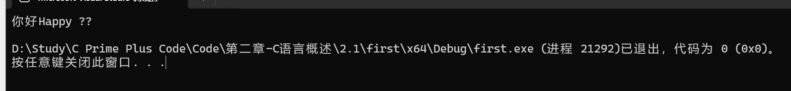
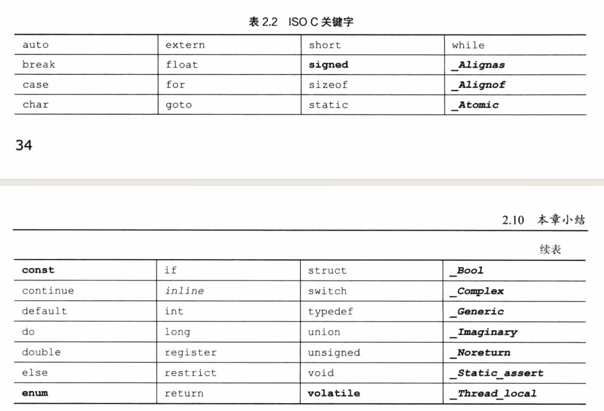
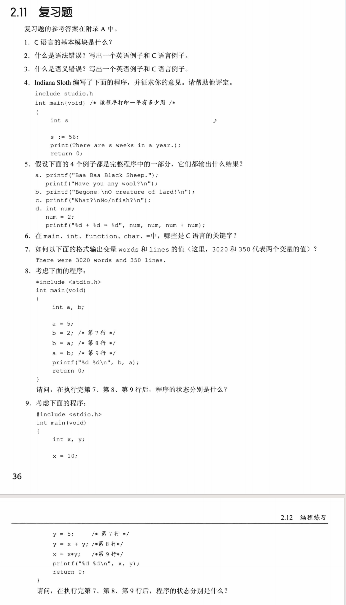

# C程序实例

```c
#include <stdio.h>
int main(void)  /*一个简单的C程序*/
{
    int num;    /*定义一个名为num的变量*/
    num = 1;    /*为num赋一个值*/
    printf("I am a simple ");    /*使用printf（）函数*/
    printf("computer.\n");
    printf("My favorite number is %d because it is first.\n", num);
    return 0;
}
```


int 和 void 是标准 ANSI C定义。

> **ANSI C**（**American National Standards Institute C**）是指由美国国家标准协会（ANSI）在 **1989 年**正式发布的 **C 语言标准**，通常称为 **C89** 或 **C90**（后被 ISO 采纳为 **ISO/IEC 9899:1990**）。

------


## main() 函数

```c
int main(void);
```

C程序一定从`main()`函数开始执行。

`()`是用于识别`main()`是一个函数。

函数是C程序的**基本模块**。

`int`是`main()`函数的返回类型，该返回的值是返回给**操作系统**的。

------

## 注释

```c
/* 一个简单的程序注释 */
```

C99新增 `//`注释

------

## 花括号、函数体和块

```c
{
    ...
}
```

C函数都使用花括号标记函数体的开始和结束。

------

## 声明

```c
int num;
```

​	声明把特定标识符与计算机内存中的特定位置联系起来，同时也确定了存储在某位置的信息类型或数据类型。

​	在C语言中，所有变量都必须先声明才能使用。

​	老版本编译器是要求变量声明在块的顶部。C99和C11遵循C++的惯例，可以把声明放在块中的任何位置。

------

## 数据类型

### 命名

​	C99和C11允许使用更长的标识符名，但是编译器只**识别前63个字符**。对于外部标识符，只允许使用31个字符。（以前C90只允许6个字符，更老的编译器通常最多只允许使用8换个字符。）由于多出的字符编译器会忽略，所以当有两个64字符的标识符，他们前63个是一样的，只有最后一个字符不同，那么编译器可能将其视为同一个名称，也可能不会。标准并未定义这种情况会发生什么。


​	可以用小写字母、大写字母、数字和下划线命名。而且，名称的第一个字符必须是字符或下划线，不能是数字。


​	C语言的名称区分大小写。

​	

​	为了让C语言更加国际化，C99和C11根据通用字符名（即UNC）机制添加了扩展字符集。其中包含了除英文字母以外的部分字符。


```c
#include <stdio.h>

int main()
{
	// 使用 UCN 定义字符串
	const char* greeting = "\u4F60\u597D";  // "你好"（Unicode 编码）

	printf("%s", greeting);

	printf("Happy \U0001F600\n");  // 输出 "Happy 😀"

	return 0;
}
```

输出结果：



旧版的CMD似乎是不支持这个格式。

------

### 声明变量的4个理由

1. 所有变量放在一处，方便读者查找和理解程序的用途。
2. 声明变量会促使你在编写程序之前做些计划。
3. 声明变量有助于发现隐藏在程序中的小错误，如变量名拼写错误。
4. 最重要的，未声明变量，C程序将无法通过编译。哈哈，这不得不声明了！

------

## 赋值

```c
num = 1;
```

​	在执行 int num；声明时，编辑器在**计算机内存**中位变量num预留了空间，然后在执行这行赋值表达式语句是，把值存储在之前**预留的位置**。

注意，该赋值表达式语句从右侧把值赋到左侧。

------

## printf() 函数

```c
printf("I am a simple ");    /*使用printf（）函数*/
printf("computer.\n");
printf("My favorite number is %d because it is first.\n", num);
```

​	第一行把 `I am a simple` 传递给`printf()`函数。该信息被称为参数，或者更确切的说，是函数的**实际参数**。

实际参数是传递给函数的特定值，形式参数是函数中用于存储值的变量。

换行符是一个转义序列。

------

## return语句

```c
return 0;
```

​	如果遗留main()函数末尾的return语句，程序在运行至最外面的右花括号是会返回0。因此，可以省略 `main()` 函数末尾的return语句。但是不建议。

------

# 进一步使用C

```c
// fathm_ft.c -- 把2英寻(fathom)转换成英尺(feet)
#include <stdio.h>
int main(void)  // 这里缺少右大括号
{
    int feet, fathoms;
    
    fathoms = 2;
    feet = 6 * fathoms;
    
    printf("There are %d feet in %d fathoms!\n", feet, fathoms);
    printf("Yes, I said %d feet!\n", 6 * fathoms);
    
    return 0;
}
```

早期的编译器，只需指定返回类型，不用描述参数。

```c
void butler();
```

​	无论，main()在程序文件处于神恶魔位置，所有的C程序都从main()开始执行。

C标准建议，要为程序中用到的所有函数提供函数原型（函数声明）。

------

# 调试程序

```c
/*nogood.c--有错误的程序*/
#include <stdio.h>
int main(void)
{
    int n，int n2,int n3;
    /*该程序有多处错误
    
    n=5；
    n2=n * n;
    n3=n2 * n2;
    printf("n = %d, n squared = %d, n cubed = %d\n", n, n2, n3)
    return 0;
}
```

# 关键字和保留标识符

粗体表示的是C90标准新增的关键字

斜体表示的是C99标准新增的关键字




# 复习题



1. C语言的基本模块是什么？

2. 语法错误是代码出现系统性错误，这种错误会导致编译出错，程序无法进行。

3. 语义错误是代码能正常运行，但是代码在某些方面存在让人难以解读的情况，常见有变量命名错误，采取其他方式命名。

4. 1) int main() {}
   2) s: = 56;
   3) print
   4) ""

5. 1. `Baa Baa Black Shepp.`
   2. `Have you any wool?`
   3. Begone!
      O cteateure of lard!
   4. 2 + 2 = 4

6. main、function和=不是关键字

7. printf("There were  %d and %d lines.", words,lines);

8. 初始化b为2。
   b = a 将 a的值赋值到b，a初始为5 现在 b 也为5了。
   a = b 将 b 的值 b的值为5，给到a也为5。

9. > 第7行：y初始化为5
   >
   > 第8行：x = 10，y = 5 ,y =10 + 5 = 15
   >
   > 第9行：x = 10 ,y = 15, x = 10 * 15 = 150

------

# 编程练习


 


