# 第四章-字符串和格式化输入输出

## 4.1 前导程序

```c
// talkback.c -- 演示与用户交互
#include <stdio.h>
#include <string.h> // 提供strlen()函数的原型
#define DENSITY 62.41 // 人体密度（单位：磅/立方英尺）

int main()
{
    float weight, volume;
    int size, letters;
    char name[40]; // name 是一个可容纳40个字符的数组
    
    printf("Hi! What's your first name?\n");
    scanf("%s", name);
    printf("%s, what's your weight in pounds?\n", name);
    scanf("%f", &weight);
    
    size = sizeof name;
    letters = strlen(name);
    volume = weight / DENSITY;
    
    printf("Well, %s, your volume is %2.2f cubic feet.\n", name, volume);
    
    printf("Also, your first name has %d letters,\n", letters);
    
    printf("and we have %d bytes to store it.\n", size);
    
    return 0;
}
```

特性：

```c
    char name[40]; // name 是一个可容纳40个字符的数组
    scanf("%s", name);
```

- **用数组储存字符串**。在该程序中，用户输入的名被储存在数组中，该数组占用内存中40个连续的字节，每个字节储存一个字符值。

```c
    scanf("%s", name);    
	printf("%s, what's your weight in pounds?\n", name);
```

- 使用`%s`转换说明来处理字符串的输入和输出。注意，scanf()中，name是没有`&`前缀的，而weight是有的。（这里并没有漏写）

```c
#define DENSITY 62.41 // 人体密度（单位：磅/立方英尺）
```

- 用C预处理把字符常量 `DENSITY`定义为 62.4

```c
    letters = strlen(name);
```

- 用C函数 `strlen()` 获取字符串的长度

------

## 4.2 字符串简介

**字符串** 是一个或多个字符的序列。

​	双引号**不是字符串的一部分**。双引号**仅告知编译器它括起来的字符串**，正如单引号用于标识单个字符一样。

### 4.2.1 char 类型数组和null字符

​	C语言没有专门用来储存字符串的变量类型，字符串都被储存在**char类型的数组**中。数组**有连续的存储单元组成**，字符串中的字符被储存在相邻的存储单元中，每个单元存储一个字符。

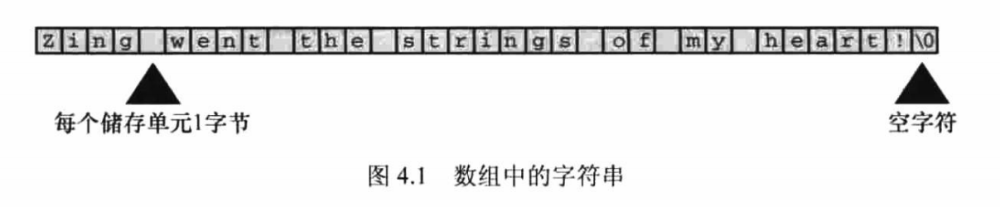

​	如图4.1 数组末尾位置的字符 `0` 。这是 **空字符（null character）** ， C语言用它**标记字符串的结束**。空字符不是数字0，它是非打印字符，其ASCII码值是（或等价于）0。

​	**C中的字符串一定以空字符结束**，这意味着数组的容量必须至少比待存储字符串中的字符数多1。数组有40个存储单元，那么留给字符串存储有效位数只有39个，剩下一个留给了空字符。


**数组**是同类型数据元素得到有序序列。

```c
    char name[40];
```

声明创建了一个包含40个存储单元的数组，每个存储单元储存一个char类型的值。

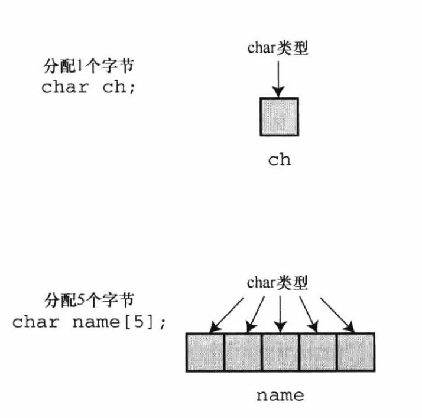

### 4.2.2 使用字符串

```c
/* praisel.c -- 使用不同类型的字符串 */
#include <stdio.h>
#define PRAISE "You are an extraordinary being."

int main(void)
{
    char name[40];
    
    printf("What's your name? ");
    scanf("%s", name);
    printf("Hello, %s. %s\n", name, PRAISE);
    
    return 0;
}
```

以上代码是能正常运行的。

​	说明字符串正常工作，C语言规定字符串末尾必须以 `\0` 结尾，这表示scanf() 在读取输入时就完成了这输入 `\0` 的操作。同样的 PRAISE 的字符串也不需要手动添加。

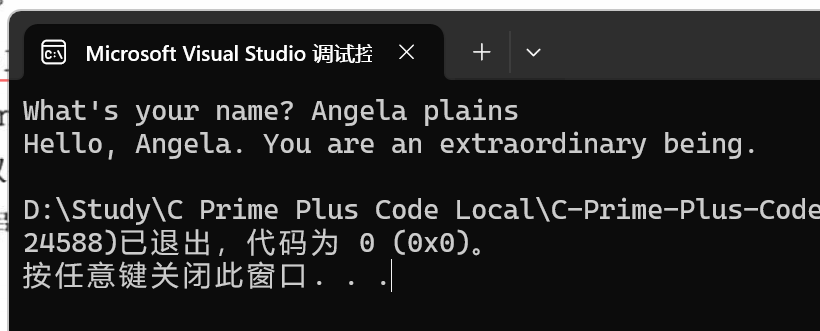

​	我输入了`Angela plains`， scanf() 只读取了 `Angela` ，原因是scanf()在遇到第一个空白（空格、制表符或换行符）时就不再读取输入。因此，scanf()在读到`Angela plains`之间的空格时就停止了。根据 %s 转换说明，scanf()只会读取字符串中的一个单词，而不是一整句（单词之间有空格）。

#### 字符串和字符 --  "x" 与 'x' 的区别

"x" 与 'x' 本质上是不同的，虽然看起来区别只是符号不同。"x" 是字符串，实际上由'x'与'\0'两个字符组成，这个'\0' 是由系统自动写入的。而'x'只是个基本类型（char）。

### 4.2.3 strlen() 函数

```c
/*praise2.c*/
//如果编译器不识别%zd，尝试换成u或lu。
#include <stdio.h>
#include <string.h> /*提供strlen（）函数的原型*/
#define PRAISE "You are an extraordinary being."

int main(void)
{
    char name[40];
    
    printf("What's your name? ");
    scanf("%s", name);
    printf("Hello, %s. %s\n", name, PRAISE);
    printf("Your name of %zd letters occupies %zd memory cells.\n",
           strlen(name), sizeof name);
    printf("The phrase of praise has %zd letters ",
           strlen(PRAISE));
    printf("and occupies %zd memory cells.\n", sizeof PRAISE);
    
    return 0;
}
```

**头文件**


```c
#include <string.h>
```

这个头文件包含多个与字符串相关的函数原型，包括 `strlen()`。

处理很长的printf()语句的方法

1. 将printf()语句分为两行（可以在参数之间断为两行，但是不要在双引号中的字符串中间断开，C语言是不允许这样的）
2. 使用两个printf()语句打印一行内容，只在第2条printf()语句中使用换行符（\n）。

```c
    char arr[] = "123";
    int length_sizeof = sizeof(arr) / sizeof(char);
    int length_strlen = strlen(arr);
    printf("length_sizeof: %d\n", length_sizeof);
    printf("length_strlen: %d\n", length_strlen);
```

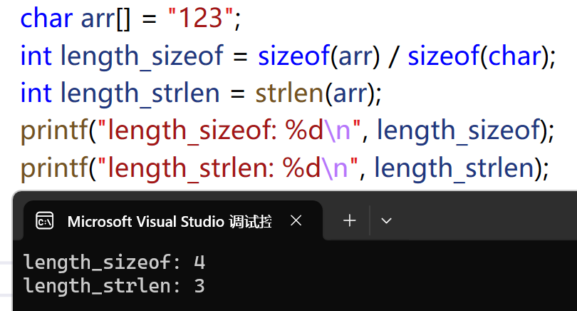

发现 sizeof 给出的数更大，因为他把字符串末尾不可见的空字符也计算在内。

strlen() 得出的也是字符串中的字符数（包括空格和标点符号）。

------

## 4.3 常量和C预处理器

```c
#define TAXRATE 0.015
```

​	C语言提供了**C 预处理器**，在编译程序时，程序中所有的 TAXRATE 都被替换成0.015。这一过程被称为 **编译时替换（compile-time substitution）**。在运行程序时，程序中所有的替换均已完成。通常，这样定义的常量也称为 **明示常量**。

**格式如下**

```c
#define NAME value
```

​	实际应用是，会选定的符号常量名和合适的值来替换 NAME 和 value。注意：**末尾不用加分号**（是直接替换，如果加上分号（非本意），分号也会替换过去导致语法出错），因为这是一种由预处理器处理的替换机制。

当然如果你确实要用这个分号也是没问题的，但是不建议这样写。

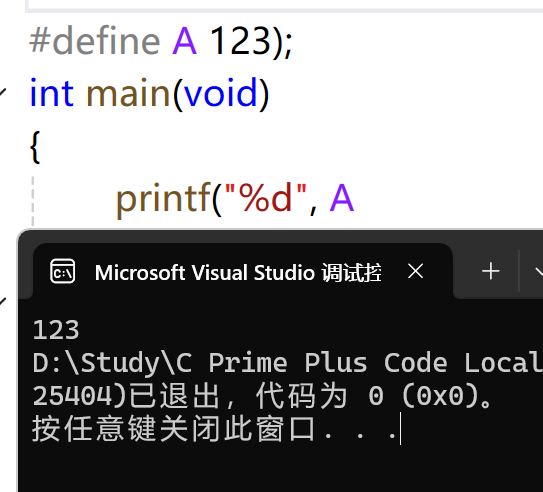

**为什么要用大写TAXRATE？**

​	用大写表示符号常量是C语言一贯的传统。这样，在程序中看到全大写的名称就立刻知道这是个符号常量，而非变量。符号常量并没规定大小写，即用小写表示符号常量也是没问题。

​	另外，还有一个不常用的命名约定，即在名称前带 `c_` 或 `k_` 前缀来表示常量（如，c_level 或 k_line）。

​	**符号常量的命名规则与变量相同**。可以使用大小写字母、数字和下划线字符，首字符不能为数字。

```c
/*pizza.c--在比萨饼程序中使用已定义的常量*/
#include <stdio.h>
#define PI 3.14159
int main(void)
{
    float area, circum, radius;
    
    printf("what is the radius of your pizza?\n");
    scanf("%f", &radius);
    
    area = PI * radius * radius;
    circum = 2.0 * PI * radius;
    
    printf("Your basic pizza parameters are as follows:\n");
    printf("circumference = %1.2f, area = %1.2f\n", circum, area);
    
    return 0;
}
```

### 4.3.1 const 限定符

C90 标准新增了 const 关键字，用与限定一个变量为只读。

```c
const int MONTHS = 12;
```

MONTHS 称为一个只读值，它能参与计算，可以打印，但就是不能修改值的内容。

### 4.3.2 明示常量

​	C 头文件 `limits.h` 和`float.h` 分别提供了与整数类型和浮点类型大小限制相关的详细信息。每个头文件都定义了一些列供实现使用的明示常量。

例如， `limits.h` 头文件包含以下类似的代码：

```c
#define INT_MAX +32767
#define INT_MIN -32768
```

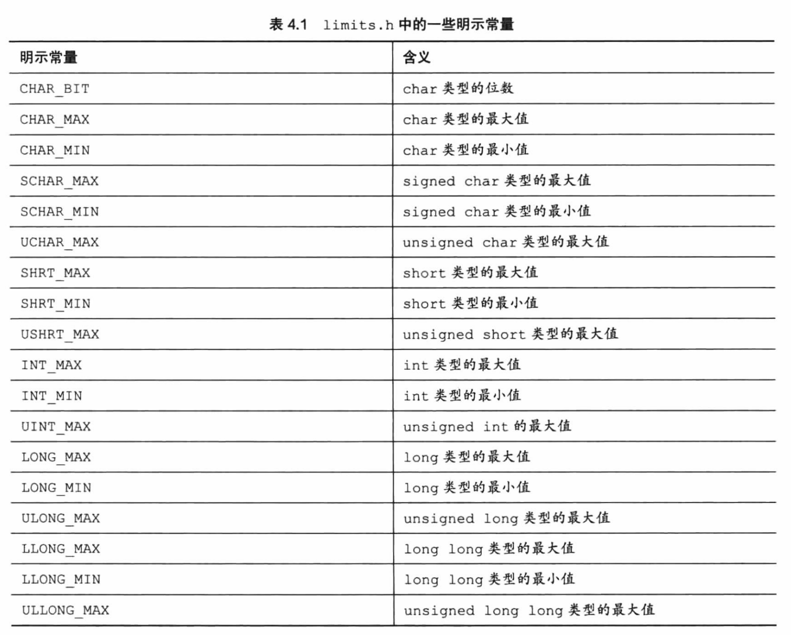

​	类似地，`float.h` 头文件中也定义一些明示常量，如 FLT_DIG 和 DBL_DIG，分别表示float类型和double类型的有效数字位数。

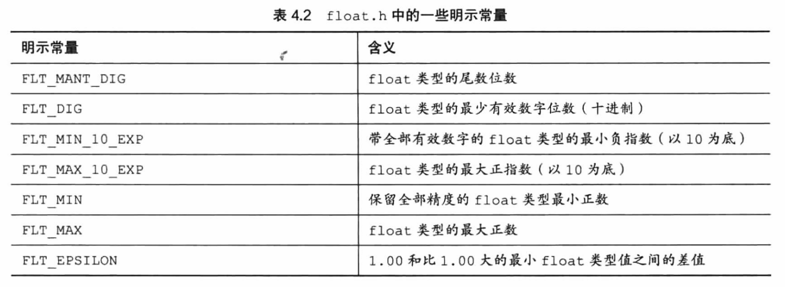

------

## 4.4 printf() 和 scanf()

​	printf()函数和scanf()函数能让用户可以与程序流程，它们是输入/输出函数，或简称为**I/O函数**。

### 4.4.1 printf() 函数

​	请求 printf()函数打印数据的指令要与待打印数据的类型相匹配。`%d` 与 `%c`，这些符号被称为**转换说明（conversion specification）**，它们指定了如何把数据转换成可显示的形式。

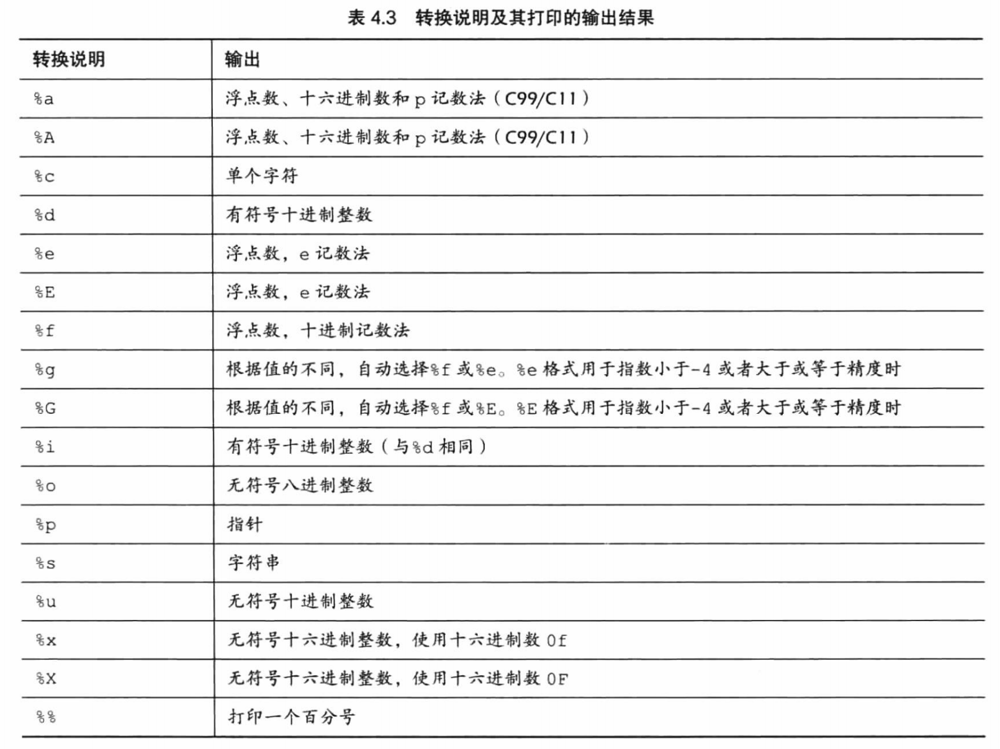

### 4.4.2 使用printf()

```c
/*printout.c--使用转换说明*/
#include <stdio.h>
#define PI 3.141593

int main(void)
{
    int number = 7;
    float pies = 12.75;
    int cost = 7800;
    
    printf("The %d contestants ate %f berry pies.\n", number, pies);
    printf("The value of pi is %f.\n", PI);
    printf("Farewell! thou art too dear for my possessing,\n");
    printf("%d\n", 2 * cost);
    
    return 0;
}
```

### 4.4.3 printf() 的转换说明修饰符

在 % 和 转换字符之间插入修饰符可修饰基本的转换说明。

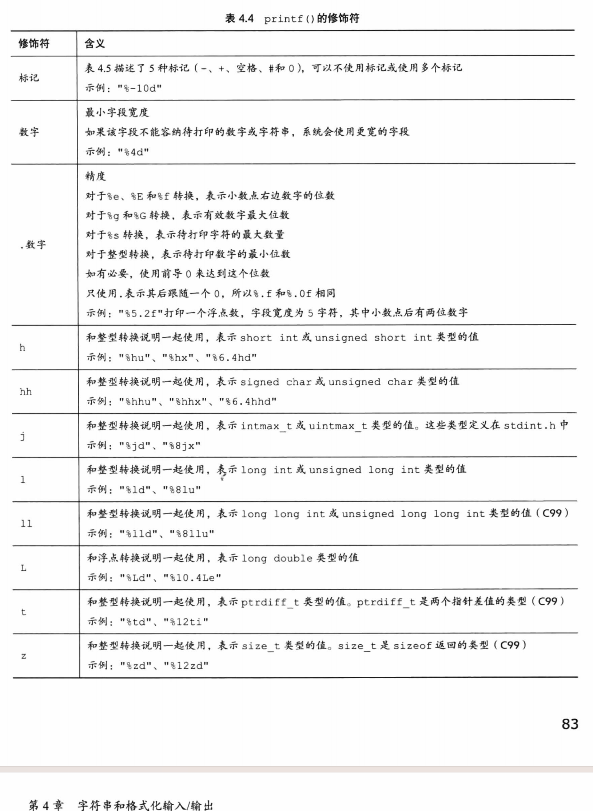

​	sizeof运算符以字节为单位返回类型或值的大小。这应该是某种形式的整数，但是标准只规定了该值是无符号整数。C提供了可移植性更好的类型。首先，`stddef.h` 头文件（在包含`stdio.h` 头文件时已包含其中）把size_t 定义成系统使用sizeof 返回的类型，这被称为底层类型（`unerlying type`）。其次，printf() 使用z修饰符表示打印相应的类型。同样，C还定义了`printff_t` 类型和t修饰符

来表示系统使用的两个地址差值的底层有符号整数类型了。

**注意 float参数的转换**

​	对于浮点类型，有用于 `double` 和 `long double` 类型的转换说明，却没有`float`类型的。这是因为在 `K & RC` 中，表达式或参数中的 **`float` 类型值会被自动转换成`double` 类型**。一般而言，**ANSIC 不会把float自动转换成double**。然而，为保护大量假设float类型的参数被自动转换成double 的现有程序，printf()函数中所有**float类型的参数（对未使用显式原型的所有C函数都有效）仍自动转换成double类型**。

> **K&R C** 指的是由 **Brian Kernighan** 和 **Dennis Ritchie**（C语言的创始人）在他们合著的经典书籍《**The C Programming Language**》（1978年出版）中描述的C语言版本。这本书通常被称为 **"K&R"**（取自两位作者姓氏的首字母），而书中定义的C语言标准被称为 **"K&R C"**。
>
> 在函数调用时，`float` 会自动转换为 `double`（如 `printf` 中的 `%f` 实际上是针对 `double` 的）。
>
> 在 **ANSI C（C89/C90）** 标准化之前，K&R C 是事实上的C语言标准。**ANSI C**为了兼容之前版本也采取同样策略，即printf()函数中所有float类型的参数（对未使用显式原型的所有C函数都有效）仍**自动转换成double类型**。

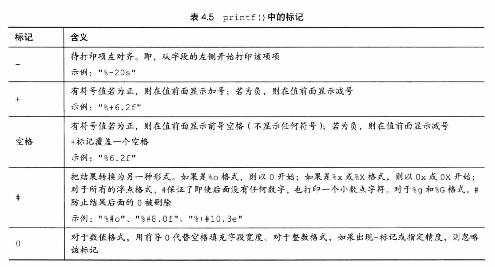

#### 1. 使用修饰符和标记的示例

```c
/*width.c--字段宽度*/
#include <stdio.h>

#define PAGES 959

int main(void)
{
    printf("*%d*\n", PAGES);
    printf("*%2d*\n", PAGES);
    printf("*%10d*\n", PAGES);
    printf("*%-10d*\n", PAGES);
    return 0;
}
```

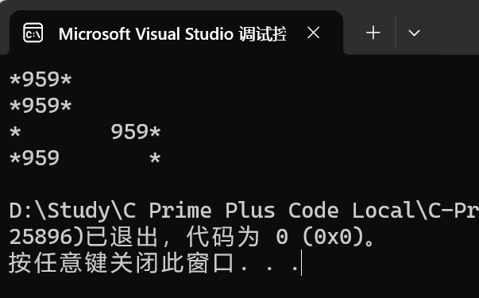

程序中使用 * 标出每个字段的开始和结束。

- 第一段，没有任何修饰符，其对应的输出结果与待整数字段宽度的转换说明的输出结果相同。默认情况下，没有任何修饰符的转换说明，就是这样打印结果。（一个%d对应一个的数值）
- 第二段，转换说明是%2d，其对应的输出结果应该是2字段宽度。因为待打印


